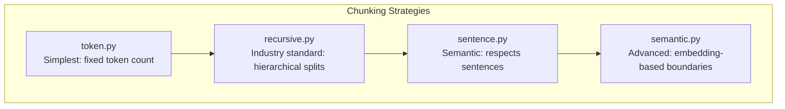
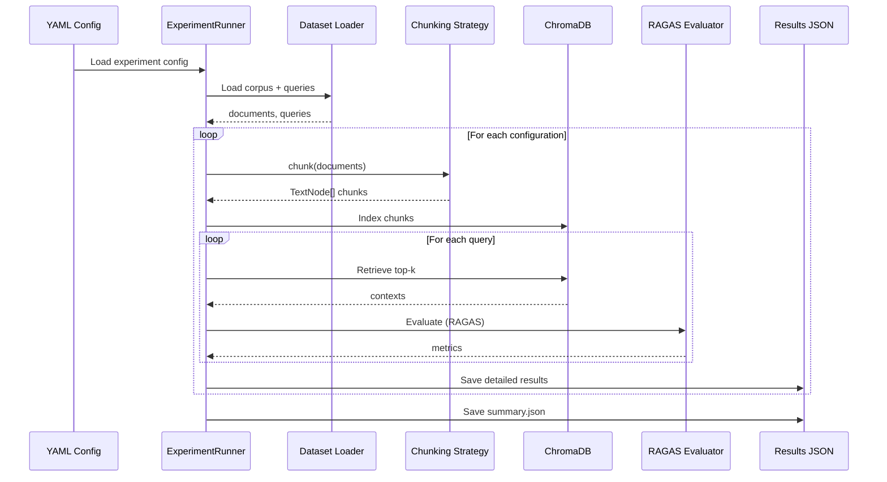
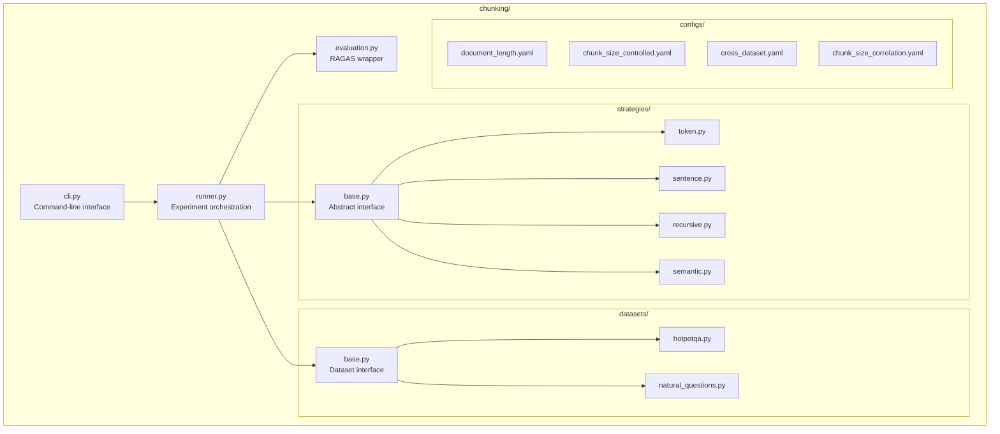

# RAG Chunking Experiments

> **The Dirty Secret**: Sentence chunking "wins" benchmarks because it ignores your chunk_size config and produces 3-4x larger chunks. When you control for size, the winner changes.

A self-contained module for learning and experimenting with RAG chunking strategies.

## What You'll Learn


This module focuses on the **chunking** step - how you split documents dramatically affects retrieval quality.

### Key Insight from Our Experiments

| Strategy | Requested Size | **Actual Size** | Recall |
|----------|---------------|-----------------|--------|
| token | 1024 | 934 | 75% |
| recursive | 1024 | 667 | 68% |
| **sentence** | 1024 | **3677** | 98% |
| semantic | 1024 | 1117 | 78% |

**Sentence chunking ignores your config and produces 3.6x larger chunks!**

This confounds every benchmark comparing "chunk strategies at the same size." Our experiments prove: **chunk SIZE matters more than chunk STRATEGY**.

---

## Quick Start

```bash
# From project root
cd rag-experiments

# Install dependencies
uv sync

# Set up API keys
cp .env.template .env  # Add OPENAI_API_KEY

# Run a smoke test
./run.sh chunking --experiment document_length

# See all experiments
./run.sh chunking --list
```

---

## Learning Path

### 1. Understand the Strategies

Start by reading the strategy implementations in order of complexity:



| File | Concept | Key Learning |
|------|---------|--------------|
| [`strategies/token.py`](strategies/token.py) | Token-based splitting | Most consistent sizes, may break mid-sentence |
| [`strategies/recursive.py`](strategies/recursive.py) | Hierarchical separators | LangChain standard, good baseline |
| [`strategies/sentence.py`](strategies/sentence.py) | Sentence boundaries | **WARNING**: Ignores chunk_size parameter! |
| [`strategies/semantic.py`](strategies/semantic.py) | Embedding similarity | Chunk size NOT controllable |

### 2. Understand the Data Flow



### 3. Understand the Metrics

| Metric | What it Measures | Range | Primary? |
|--------|------------------|-------|----------|
| `context_recall` | Did we retrieve the answer? | 0-1 | **Yes** |
| `context_precision` | Is retrieved context relevant? | 0-1 | No |
| `faithfulness` | Is answer faithful to context? | 0-1 | No |
| `retrieval_success_rate` | Binary: answer in context? | 0-1 | No |

**Why context_recall is primary**: If you don't retrieve the right context, the LLM can't answer correctly. Everything else is secondary.

### 4. Run Experiments

```bash
# Start with document_length (fastest)
./run.sh chunking -e document_length

# Then try chunk_size_controlled (the key experiment)
./run.sh chunking -e chunk_size_controlled

# View results
cat chunking/results/chunk_size_controlled/summary.json | jq '.results[] | {config, strategy, actual_chunk_size, context_recall}'
```

---

## Module Architecture



---

## The Four Experiments

### Experiment 1: `document_length`
**Question**: Does document length affect optimal strategy?

```yaml
# 12 configurations: 4 strategies × 3 lengths
strategies: [token, sentence, recursive, semantic]
lengths: [short (<5K), medium (5-10K), long (>10K)]
```

**Finding**: Sentence chunking wins across all lengths... but it's cheating with larger chunks.

### Experiment 2: `chunk_size_controlled`
**Question**: When chunk sizes are controlled, which strategy wins?

```yaml
# The key experiment - isolates strategy effect
chunk_sizes: [~1000, ~3000 chars]
# Forces fair comparison (except sentence still cheats)
```

**Finding**: At ~3000 chars, token (2800) achieves 97.5% vs sentence (8150) at 95%. Size > strategy.

### Experiment 3: `cross_dataset`
**Question**: Do findings generalize to different data?

```yaml
# Test on Natural Questions (96K char Wikipedia articles)
# Much longer than HotpotQA (3-9K chars)
```

**Finding**: Correlation r=0.98 between chunk size and recall. Finding generalizes.

### Experiment 4: `chunk_size_correlation`
**Question**: Is chunk size vs recall relationship linear?

```yaml
# Vary only chunk size, hold strategy constant
chunk_sizes: [~1000, ~2000, ~3000 chars]
strategy: token  # Controlled
```

**Finding**: r=0.92 correlation. Larger chunks = better recall (up to a point).

---

## Results Summary

### The Money Chart

Our experiments reveal **chunk size is the dominant factor** (r=0.74):

| Chunk Size | Expected Recall |
|------------|-----------------|
| ~700 chars | 67-75% |
| ~1000 chars | 75-80% |
| ~2000 chars | 85-90% |
| ~3000 chars | 90-97% |

### Practical Recommendations

| Use Case | Strategy | Chunk Size | Why |
|----------|----------|------------|-----|
| General RAG | recursive | 2000-3000 | Industry standard, undershoots ~35% |
| Max recall | token | 2500-3500 | Only strategy with precise size control |
| Quick prototype | sentence | default | Works well, just know it's 3.6x larger |
| Semantic docs | semantic | N/A | When you want content-driven splits |

---

## Extending the Module

### Add a Custom Chunking Strategy

```python
# chunking/strategies/my_strategy.py
from chunking.strategies.base import ChunkingStrategy

class MyChunker(ChunkingStrategy):
    """My custom chunking approach."""

    name = "my_chunker"

    def __init__(self, chunk_size=1024, chunk_overlap=128, **kwargs):
        super().__init__(chunk_size, chunk_overlap, **kwargs)
        # Your initialization

    def chunk(self, documents):
        nodes = []
        for doc in documents:
            # Your chunking logic
            pass
        return nodes
```

Register in `strategies/__init__.py`:
```python
from .my_strategy import MyChunker
STRATEGIES["my_chunker"] = MyChunker
```

### Add a Custom Dataset

```python
# chunking/datasets/my_dataset.py
from chunking.datasets.base import Dataset, Query

class MyDataset(Dataset):
    """Load data from my source."""

    name = "my_dataset"

    def load(self, num_examples=40, **kwargs):
        corpus = {}  # doc_id -> {"title": str, "text": str}
        queries = []  # List[Query]
        # Load your data
        return corpus, queries
```

---

## File Reference

| File | Purpose | Key Concepts |
|------|---------|--------------|
| `runner.py` | Orchestrates experiments | Checkpointing, result saving |
| `evaluation.py` | RAGAS wrapper | Metrics computation |
| `cli.py` | Command-line interface | Click framework |
| `strategies/base.py` | Strategy interface | Abstract base class |
| `strategies/token.py` | Token chunking | `TokenTextSplitter` |
| `strategies/sentence.py` | Sentence chunking | **Ignores chunk_size!** |
| `strategies/recursive.py` | Recursive chunking | Hierarchical separators |
| `strategies/semantic.py` | Semantic chunking | Embedding boundaries |
| `datasets/base.py` | Dataset interface | `Query` dataclass |
| `datasets/hotpotqa.py` | HotpotQA loader | Multi-hop QA |
| `datasets/natural_questions.py` | NQ loader | Long Wikipedia articles |

---

## Troubleshooting

### "OPENAI_API_KEY not found"
```bash
export OPENAI_API_KEY=sk-...
# Or add to .env file
```

### "Ollama connection refused"
```bash
ollama serve &
ollama pull mistral:7b
```

### "Rate limit exceeded"
- Reduce `num_queries` in config
- Add `RAGAS_BATCH_SIZE=5` to environment

---

## Key Takeaways

1. **Chunk SIZE > chunk STRATEGY** - Larger chunks (2500-3500 chars) beat smaller chunks regardless of strategy

2. **Sentence chunking lies** - LlamaIndex SentenceSplitter ignores your chunk_size parameter

3. **Test on YOUR data** - Our findings on HotpotQA/NQ may not apply to your domain

4. **Control your variables** - When comparing strategies, ensure chunk sizes are actually comparable

---

## License

MIT License - see LICENSE file for details.
